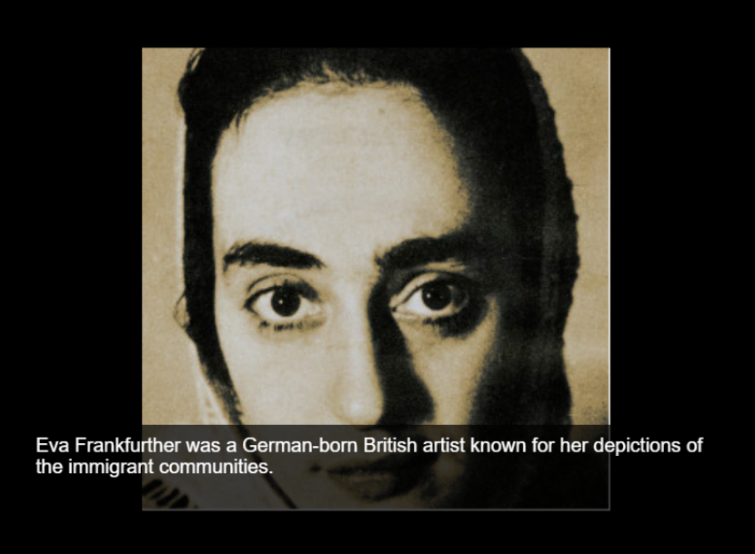
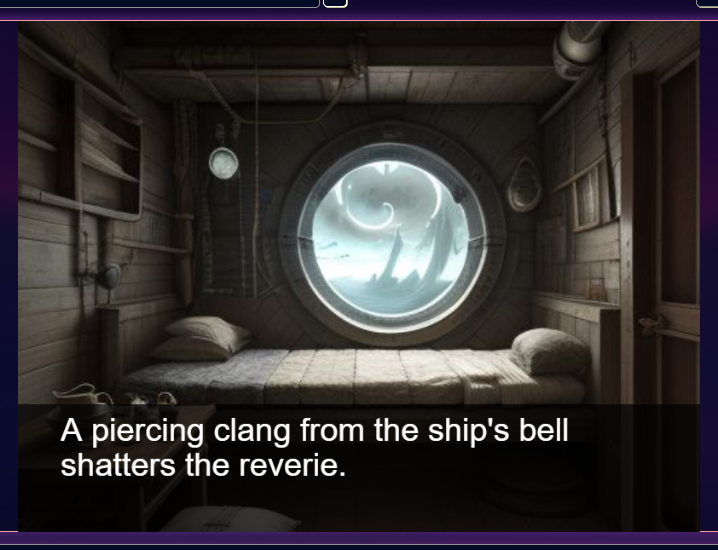

# Eva Frankfurther 
A short story and chat diologue about Eva Frankfurther the German born British artist.Aimed at ages 18-25, the 1-2 minute game offers a quick look into the life of eva, a refugee. 

## Link to deployed page: 
https://vickysug.github.io/eva-frankfurther/

## Link to my storyborad on Canva: 
https://www.canva.com/design/DAGJuJ_myKo/0hOOKT0udazoPDWKISUbrw/edit?utm_content=DAGJuJ_myKo&utm_campaign=designshare&utm_medium=link2&utm_source=sharebutton

## Project Brief

This project was one of several while on my internship with BIZGEES. The brief:

* Select a celebrity/famous person who was/is a refugee.

* Compile the information and background.

* Create a short 30 second - 2 minute game aimed at age group 18 -25.

* The game is to allow the player to learn about the refugee.

* Use AI to aid the creation.

## Technologies used

For the project the aim was to use AI, mainly Rosebud AI (https://play.rosebud.ai/home)

On the platform a developer can clone games created by other developers and change them for their own purpose. 

I chose to use a game called The Galena Uprising, Evolved from: Visual Novel AI Template, Created by: aikostvn.

https://play.rosebud.ai/games/3111eef5-e349-459b-8028-1b9ddc647de7

Rosebud can generate AI images, I created some in Rosebud and some I searched for and edited in Photoshop. 
Rosebud also allows the AI chat to change code, I used this as well as coding myself. 

If I were to expand the game further, it would include another scene where the player could view artwork.

Link to the game in Rosebud: 
https://play.rosebud.ai/games/0499403b-461b-4d10-91e9-4ed91a6f9b9b